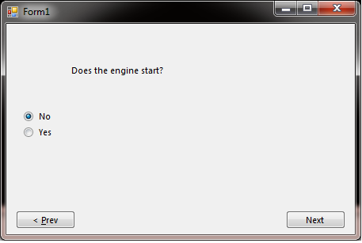
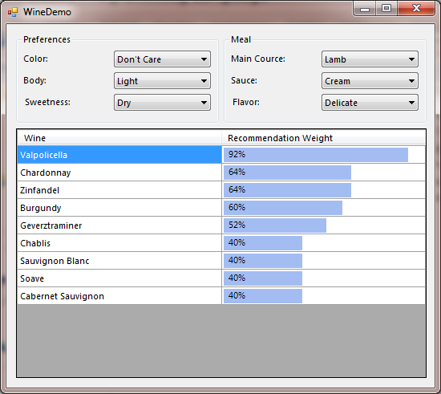

**Project Description**
CLIPS.NET is  .NET   managed interface for CLIPS (C Language Integrated Production System)

CLIPS.NET is an effort to bring CLIPS into the .NET world. Framework is allowing a convenient and easy integrating Clips expert system in your .NET projects. 

Project contains a precompiled version of core CLIPS library and the interface framework,  examples with source code. Inspiration for most of them is from [CLIPSJNI](http://clipsrules.sourceforge.net/CLIPSJNIBeta.html).

More information about clips you can find at [CLIPS](http://clipsrules.sourceforge.net/)

Currently project includes 2 fully working examples, but idea is they to grow. Initial release will consist of 4 examples which correspond to the CLIPSJNI ones. Of course primary goal here is a _"proof of concept"_ and demonstration of basic way to interact with Mommosoft.ExpertSystem Framework. Next big step is user defined functions support.

## AutoDemo

## WineDemo

Documentation

All the feedback is welcome at the beginning and vital  point of the project.

